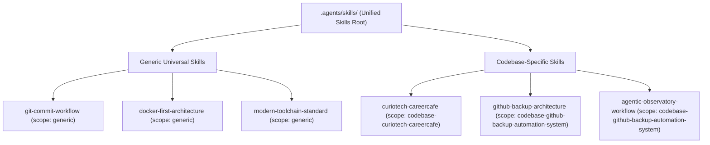

# Skill Taxonomy & Scope Governance Standard

This skill defines the mandatory classification, directory isolation, and validation protocols for authoring and maintaining AI agent skills across the ecosystem.

---

## 1. The Scope Taxonomy

Every skill in the ecosystem MUST belong to exactly one of two distinct categories:

| Scope | Directory Location | Target Audience | Frontmatter Requirement |
|---|---|---|---|
| **`generic`** | `.agents/skills/<skill-name>/` | Any repository across all languages and frameworks | `scope: generic` |
| **`codebase-{name}`** | `.agents/skills/<skill-name>/` | Exclusively the specified codebase / project | `scope: codebase-{name}` |



---

## 2. Invariants for `scope: generic` Skills

Skills tagged with `scope: generic` are distributed to downstream projects via `skills-sync pull`. They must remain strictly universal:

1. **Frontmatter**: Must explicitly set `scope: generic`.
2. **Zero Hardcoded Paths**: Never reference local machine paths (e.g. `file:///home/...`, `/Users/...`). Use relative or conceptual directory paths (`backend/`, `src/`, `config/`).
3. **Zero Hardcoded Usernames**: Never hardcode GitHub usernames or email addresses. Use parameters like `<github-username>`, `<developer-or-agent>`, `@me`, or `@$(gh api user -q .login)`.
4. **Zero Project-Specific Leaks**: Never mention specific proprietary product names, specific microservice package names, or proprietary database schemas in normative rules. Examples must be generalized.
5. **No Domain-Specific UI Palettes**: Project-specific design tokens (e.g. brand-specific hex codes, product-specific color palettes) belong in codebase-specific skills, not in generic skills.

---

## 3. Invariants for `scope: codebase-{codebase-name}` Skills

Skills tagged with `scope: codebase-{codebase-name}` are tailored exclusively to a single application or product:

1. **Frontmatter Matching**: The `scope` field in `SKILL.md` MUST explicitly declare the target codebase (e.g. `scope: codebase-curiotech-careercafe`).
2. **Explicit Disclaimer**: The body of every codebase-specific `SKILL.md` MUST begin with an explicit alert block declaring its target repository:
   ```markdown
   > [!IMPORTANT]
   > **CODEBASE-SPECIFIC SCOPE**: This skill is strictly specific to **<Codebase Name>**.
   ```
3. **Concrete Runbooks**: May contain exact file paths, exact service names, specific database schemas, and project-specific CLI workflows.

---

## 4. Cross-Contamination Prevention Rule

> [!CAUTION]
> **STRICT PROHIBITION ON MIXING SCOPE CONVENTIONS**:
> - Generic skills MUST NEVER leak proprietary terms from target codebases.
> - Automated CI validators and pre-commit hooks will automatically reject any generic skill that contains codebase-specific leaks or lacks `scope: generic`.
> - Codebase skills MUST have their explicit disclaimer to prevent accidental application to generic repositories.

---

## 5. Authoring & Validation Runbook

When creating a new skill:

1. **Determine Scope**:
   - Is this skill applicable to any standard software repository? $\rightarrow$ Place in `.agents/skills/<name>/` with `scope: generic`.
   - Is this skill tightly coupled to a specific product, schema, or brand? $\rightarrow$ Place in `.agents/skills/<name>/` with `scope: codebase-<name>`.

2. **Execute Validation**:
   ```bash
   # Run the unified validator across all scopes
   python3 scripts/validate-skills.py

   # Run the scope boundary unit test suite
   python3 -m unittest discover -s tests -p "test_*.py"
   ```
